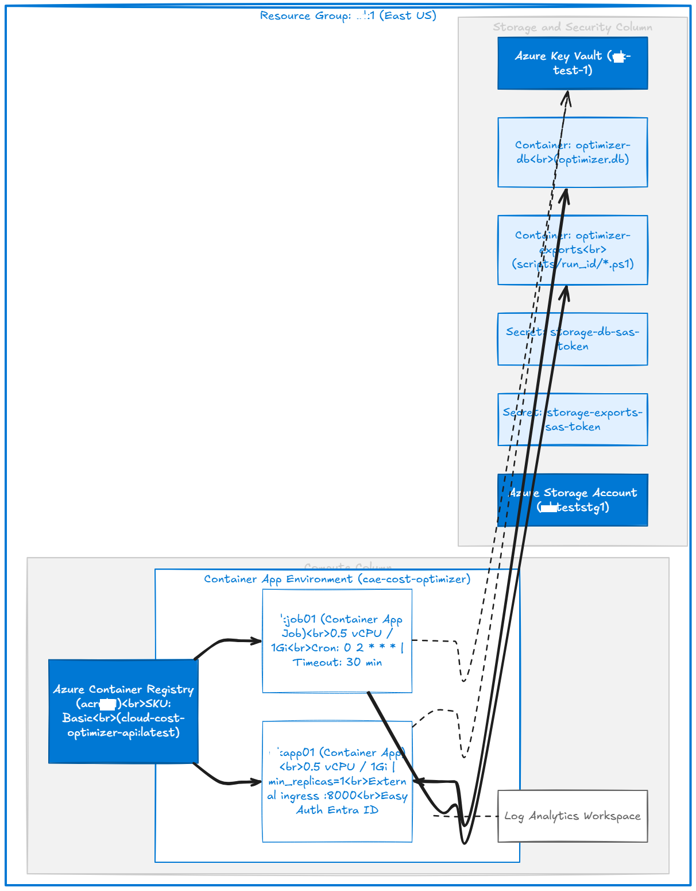
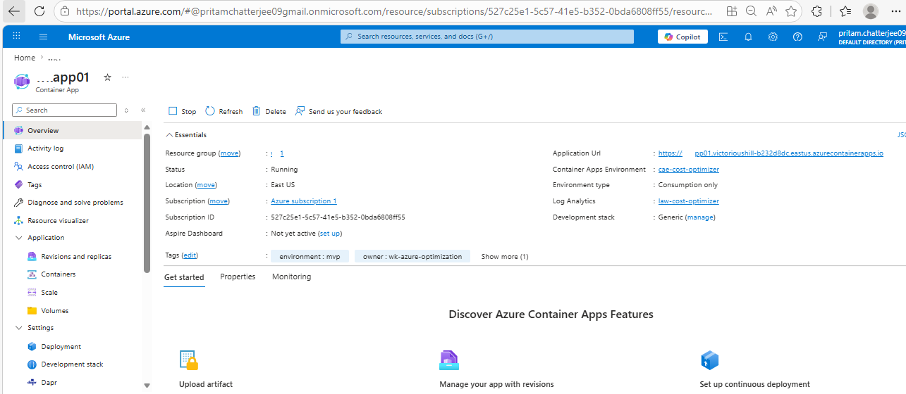
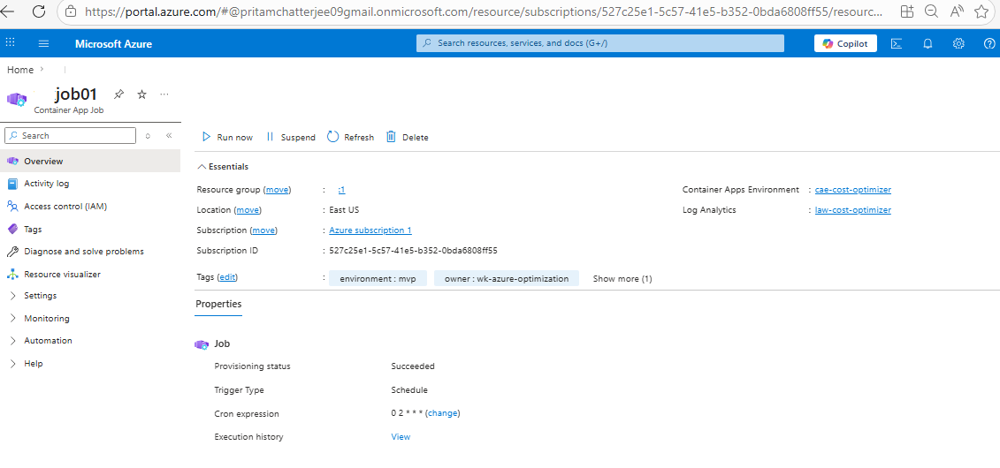
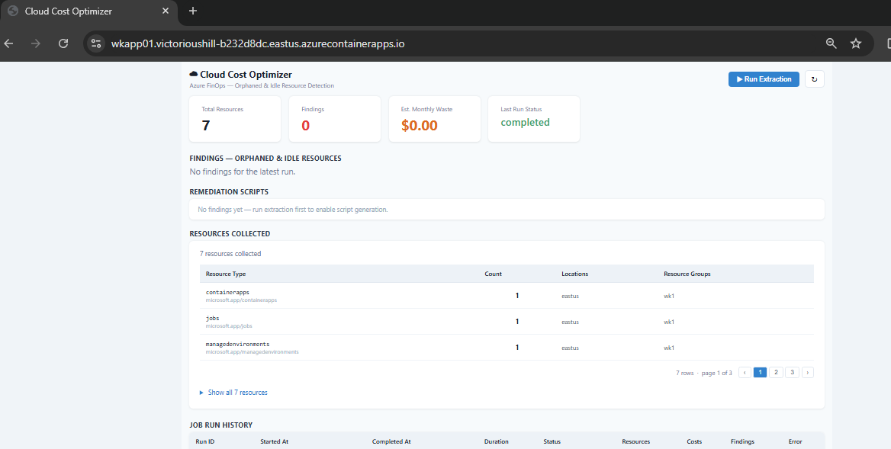
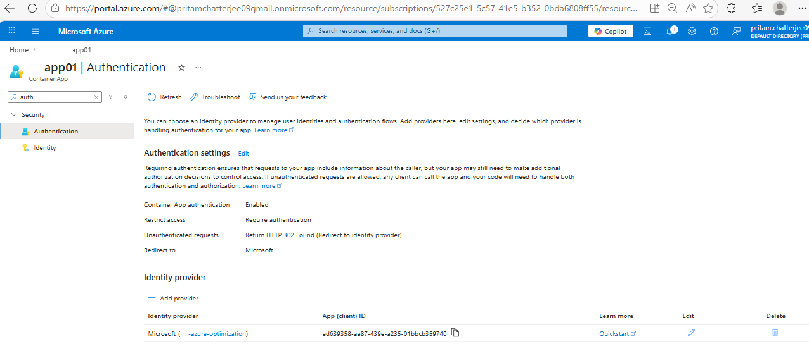
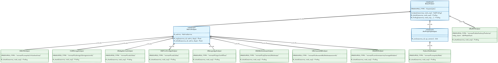
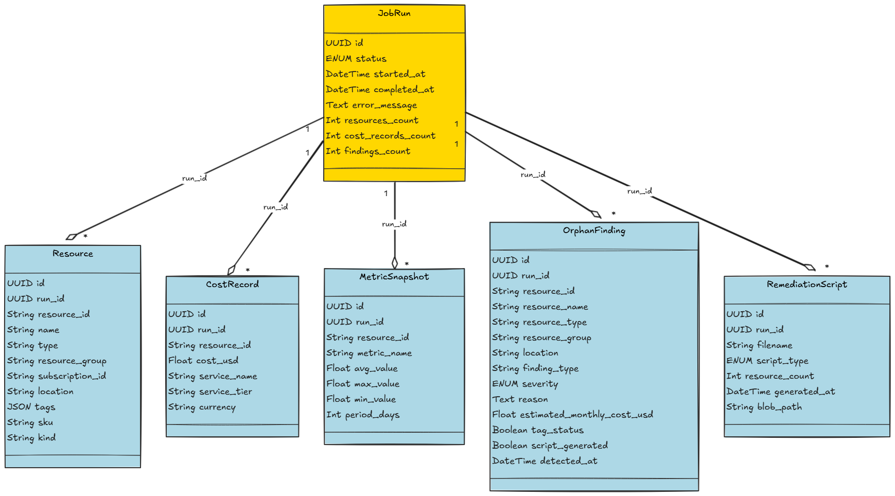
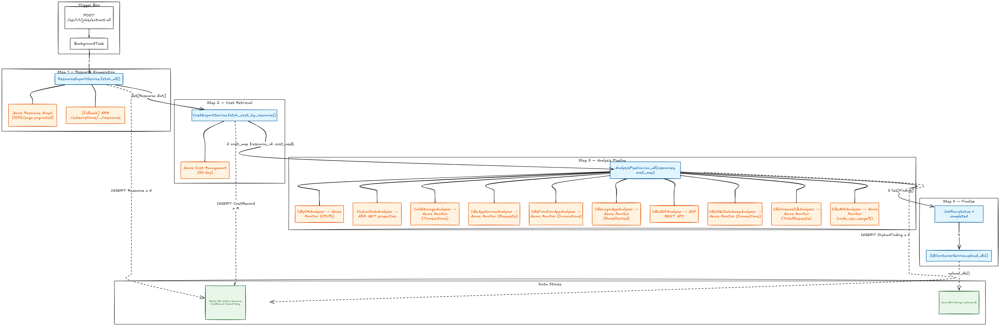
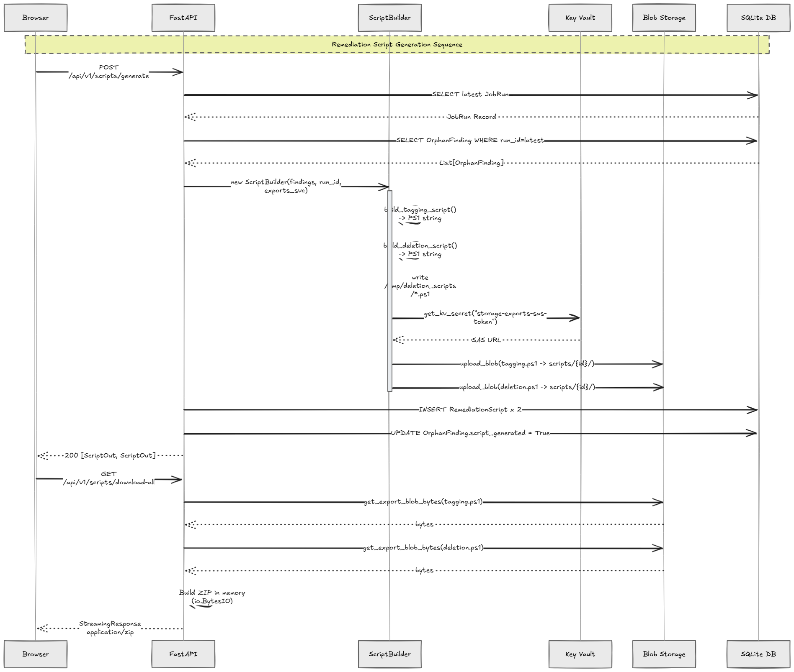

# Cloud Cost Optimizer & Remediation Engine — Design & Architecture Document

**Version:** 2.0  
**Author:** Engineering Team  
**Date:** May 2026  
**Status:** MVP — Production  
**Live URL:** https://tstapp01.victorioushill-b232d8dc.eastus.azurecontainerapps.io

> **What's new in v2.0:** Added architecture diagrams and application screenshots throughout each section.

---

## Table of Contents

1. [Executive Summary](#1-executive-summary)
2. [High-Level Requirements](#2-high-level-requirements)
3. [Solution Architecture](#3-solution-architecture)
4. [Deployment & Infrastructure Architecture](#4-deployment--infrastructure-architecture)
5. [Security Architecture](#5-security-architecture)
6. [Solution Design](#6-solution-design)
7. [Low-Level Design](#7-low-level-design)
8. [API Reference](#8-api-reference)
9. [Infrastructure Reference](#9-infrastructure-reference)
10. [Test Coverage Report](#10-test-coverage-report)

---

## 1. Executive Summary

The **Cloud Cost Optimizer & Remediation Engine** is a fully automated, cloud-native platform that continuously discovers waste in an Azure subscription, quantifies the financial impact, and generates executable PowerShell remediation scripts — all surfaced through a secure, authenticated web dashboard.

The system runs a nightly analysis pipeline that:
1. Enumerates every resource in the subscription via Azure Resource Graph.
2. Pulls 30-day cost data from Azure Cost Management.
3. Interrogates Azure Monitor metrics and ARM properties across **10 resource types**.
4. Classifies idle/orphaned resources as `OrphanFinding` records with severity ratings.
5. Generates ready-to-run PowerShell tagging and deletion scripts, zipped for download.

The solution is secured by **Azure Entra ID Easy Auth** (MFA-capable) and deployed as an **Azure Container App** (API + React SPA) with a **Container App Job** for scheduled pipeline runs.

### Application — Live Dashboard

> The dashboard is accessible at the live URL above. Users are required to authenticate via Entra ID before any content is served.


*Figure 1.1 — React dashboard showing KPIs (total waste, findings, resources), the findings table, and remediation script controls.*

---

## 2. High-Level Requirements

### 2.1 Functional Requirements

| ID | Requirement |
|----|-------------|
| FR-01 | The system **SHALL** enumerate all resources in a target Azure subscription. |
| FR-02 | The system **SHALL** retrieve 30-day cost data per resource from Azure Cost Management. |
| FR-03 | The system **SHALL** analyse VM idle state using Azure Monitor CPU metrics. |
| FR-04 | The system **SHALL** detect orphaned (unattached) Managed Disks via ARM properties. |
| FR-05 | The system **SHALL** detect idle App Services with zero HTTP traffic. |
| FR-06 | The system **SHALL** detect idle Azure Function Apps with zero invocations. |
| FR-07 | The system **SHALL** detect idle Logic Apps with zero run history. |
| FR-08 | The system **SHALL** detect idle ADF pipelines with zero run activity. |
| FR-09 | The system **SHALL** detect idle SQL Databases with zero connections. |
| FR-10 | The system **SHALL** detect idle Cosmos DB accounts with zero requests. |
| FR-11 | The system **SHALL** detect idle AKS clusters below CPU thresholds. |
| FR-12 | The system **SHALL** detect cold Storage Accounts with no recent transactions. |
| FR-13 | The system **SHALL** assign severity (high / medium / low) and estimate monthly cost savings per finding. |
| FR-14 | The system **SHALL** generate a PowerShell tagging script (`az resource tag`) for all findings. |
| FR-15 | The system **SHALL** generate a PowerShell deletion script (`az resource delete`) with confirmation prompts. |
| FR-16 | The system **SHALL** package generated scripts into a downloadable ZIP archive. |
| FR-17 | The system **SHALL** expose a React web dashboard showing KPIs, findings, job history, and scripts. |
| FR-18 | The system **SHALL** run the analysis pipeline automatically on a nightly cron schedule (`0 2 * * *`). |
| FR-19 | The system **SHALL** support on-demand pipeline execution via REST API. |
| FR-20 | The system **SHALL** persist all run results in a relational database. |

### 2.2 Non-Functional Requirements

| ID | Requirement | Target |
|----|-------------|--------|
| NFR-01 | **Authentication** | Entra ID Easy Auth on all web traffic; MFA-capable |
| NFR-02 | **Authorization** | Service Principal with Reader + Cost Management Reader roles |
| NFR-03 | **Availability** | Container App min_replicas=1 (always-on API) |
| NFR-04 | **Scalability** | Resource Graph with skipToken pagination handles 1 000+ resources per page |
| NFR-05 | **Configurability** | All thresholds via environment variables / Terraform variables |
| NFR-06 | **Observability** | Structured JSON logging → Log Analytics Workspace |
| NFR-07 | **Resilience** | ARG → ARM fallback for resource enumeration; graceful metric failure handling |
| NFR-08 | **Secret Management** | All secrets (SAS URLs) stored in Azure Key Vault; never in code or env vars |
| NFR-09 | **Cost** | Min footprint: 0.5 vCPU / 1 Gi per replica; Job runs 30-min max |
| NFR-10 | **DB Durability** | SQLite database blob-synced to Azure Storage on every shutdown |
| NFR-11 | **Portability** | `DATABASE_PROVIDER` supports SQLite, PostgreSQL, MySQL, SQL Server |
| NFR-12 | **Container** | Multi-stage Docker build; React assets baked into single image |

### 2.3 Analysis Thresholds (configurable)

| Parameter | Default | Description |
|-----------|---------|-------------|
| `IDLE_VM_CPU_THRESHOLD_PCT` | 5.0% | Avg CPU below this → idle_vm finding |
| `IDLE_AKS_CPU_THRESHOLD_PCT` | 10.0% | AKS node CPU below this → idle_aks finding |
| `IDLE_STORAGE_DAYS` | 30 | No transactions in N days → cold_storage finding |
| `IDLE_APP_DAYS` | 30 | Zero HTTP requests in N days → idle_app_service finding |
| `IDLE_DB_DAYS` | 30 | Zero connections in N days → idle_sql_db finding |
| `ANALYSIS_LOOKBACK_DAYS` | 30 | Azure Monitor metric window |

---

## 3. Solution Architecture

### 3.1 High-Level Component Diagram


*Figure 3.1 — High-level solution architecture showing the browser, Azure Container Apps (API + Job), Azure APIs, Key Vault, Storage, and Container Registry.*

```
┌─────────────────────────────────────────────────────────────────────────────────────┐
│                              Azure Subscription (tst1)                               │
│                                                                                     │
│  ┌──────────┐   HTTPS    ┌─────────────────────────────────┐                       │
│  │  Browser │ ─────────► │   Azure Container App (tstapp01)  │                       │
│  │  (User)  │ ◄───────── │                                  │                       │
│  └──────────┘            │  ┌────────────────────────────┐  │                       │
│                          │  │   Easy Auth (Entra ID)      │  │                       │
│                          │  └─────────────┬──────────────┘  │                       │
│                          │                │ authenticated    │                       │
│                          │  ┌─────────────▼──────────────┐  │    ┌───────────────┐  │
│                          │  │  FastAPI (port 8000)        │  │    │  Azure        │  │
│                          │  │  + React SPA (static)       │  │◄──►│  Key Vault    │  │
│                          │  └─────────────┬──────────────┘  │    │  (tst-test-1)  │  │
│                          └────────────────┼─────────────────┘    └───────────────┘  │
│                                           │                                         │
│  ┌─────────────────────────┐              │ REST calls                              │
│  │  Container App Job      │              │                                         │
│  │  (tstjob01)              │              ▼                                         │
│  │  Cron: 0 2 * * *        │    ┌─────────────────────────────────────────┐        │
│  │  Same image, env vars   │    │         Azure APIs                      │        │
│  └──────────┬──────────────┘    │  ┌──────────────────────────────────┐   │        │
│             │ pipeline          │  │  Resource Graph API               │   │        │
│             │ trigger           │  │  Cost Management API              │   │        │
│             └───────────────────►  │  Azure Monitor Metrics API        │   │        │
│                                 │  │  ARM Resources API                │   │        │
│                                 │  └──────────────────────────────────┘   │        │
│                                 └─────────────────────────────────────────┘        │
│                                                                                     │
│  ┌───────────────────────────────────────────────────────────┐                     │
│  │  Azure Storage Account (tstteststg1)                        │                     │
│  │  ┌─────────────────────┐  ┌──────────────────────────┐    │                     │
│  │  │  optimizer-db       │  │  optimizer-exports        │    │                     │
│  │  │  (SQLite blob)      │  │  (remediation scripts)    │    │                     │
│  │  └─────────────────────┘  └──────────────────────────┘    │                     │
│  └───────────────────────────────────────────────────────────┘                     │
└─────────────────────────────────────────────────────────────────────────────────────┘
```

### 3.2 Key Architectural Decisions

| Decision | Choice | Rationale |
|----------|--------|-----------|
| **Serving model** | Single container (API + SPA) | Simpler deployment; React assets baked at build time |
| **Database** | SQLite (blob-backed) | Zero config for MVP; upgrade path to PostgreSQL/MySQL/SQL Server via `DATABASE_PROVIDER` |
| **Resource enumeration** | Azure Resource Graph (ARG) with ARM fallback | ARG handles all resource types and 1 000-per-page pagination efficiently |
| **Metric collection** | Azure Monitor Metrics REST API (per-resource) | Native Azure telemetry; 30-day lookback |
| **Secret storage** | Azure Key Vault (SAS URLs) | Secrets never in code or environment variables |
| **Auth** | Easy Auth (platform-managed) | Zero-code Entra ID integration; MFA via tenant policy |
| **Scheduling** | Container App Job (cron) | No separate scheduler infrastructure; shares same image |

---

## 4. Deployment & Infrastructure Architecture

### 4.1 Azure Infrastructure Topology



*Figure 4.1 — diagram showing the full Azure resource topology within resource group tst1.*

```
Resource Group: tst1  (East US)
│
├── Azure Container Registry: acrtst1
│   └── Image: acrtst1.azurecr.io/cloud-cost-optimizer-api:latest
│
├── Log Analytics Workspace: (cost-optimizer-law)
│
├── Container App Environment: cae-cost-optimizer
│   ├── Container App: tstapp01  (API + SPA)
│   │   ├── Replicas: min=1, max=10
│   │   ├── Resources: 0.5 vCPU / 1.0 Gi
│   │   ├── Port: 8000 (HTTP ingress → external)
│   │   ├── Easy Auth: Entra ID (RedirectToLoginPage)
│   │   └── Env vars (secret refs from KV + direct):
│   │       AZURE_TENANT_ID, AZURE_CLIENT_ID, AZURE_CLIENT_SECRET (KV ref)
│   │       AZURE_SUBSCRIPTION_ID, AZURE_KEYVAULT_URL
│   │       AZURE_STORAGE_ACCOUNT_URL, DATABASE_PROVIDER=sqlite
│   │       + all threshold vars
│   │
│   └── Container App Job: tstjob01  (Pipeline scheduler)
│       ├── Trigger: Schedule (cron "0 2 * * *" UTC)
│       ├── Resources: 0.5 vCPU / 1.0 Gi
│       ├── Max duration: 1800s (30 min)
│       ├── Parallelism: 1
│       └── Same image + env vars as tstapp01
│
├── Azure Key Vault: tst-test-1
│   ├── Secret: storage-db-sas-token     (SAS URL for optimizer-db container)
│   ├── Secret: storage-exports-sas-token (SAS URL for optimizer-exports container)
│   └── Access Policy: SP → get/list secrets
│
└── Azure Storage Account: tstteststg1
    ├── Container: optimizer-db
    │   └── Blob: optimizer.db  (SQLite database, synced on shutdown/startup)
    └── Container: optimizer-exports
        └── Blobs: scripts/{run_id}/tagging_*.ps1
                   scripts/{run_id}/deletion_*.ps1
```

### 4.2 Azure Portal — Deployed Resources

#### Resource Group Overview


*Figure 4.2 — Azure portal showing all deployed resources in resource group `tst1`: Container Registry, Container App Environment, Container Apps (API + Job), Key Vault, and Storage Account.*

#### Container App — API (tstapp01)



*Figure 4.3 — Container App `tstapp01` in the Azure portal showing the running revision, external HTTPS ingress, replica count (min=1), and Easy Auth configuration.*

#### Container App Job (tstjob01)



*Figure 4.4 — Container App Job `tstjob01` showing the cron schedule (`0 2 * * *` UTC), 30-minute replica timeout, and execution history.*

### 4.3 Application URL



*Figure 4.5 — The live application URL as served through Azure Container Apps external ingress with HTTPS.*

### 4.4 Container Image Build

The `Dockerfile.api` uses a **two-stage build**:

| Stage | Base | Purpose |
|-------|------|---------|
| `dashboard-build` | `node:20-alpine` | `npm install` + `npm run build` → `/dashboard/dist` |
| `api` | `python:3.11-slim` | Installs Python deps via `uv`; copies API source + built React assets |

The final image exposes port `8000` and starts with:
```
uvicorn api.main:app --host 0.0.0.0 --port 8000
```

Static React files are served by FastAPI's `StaticFiles` mount, eliminating the need for a separate web server.

### 4.5 Terraform IaC Structure

```
infra/
├── main.tf            — Provider config (azurerm ~> 3.110), resource group data source
├── variables.tf       — All input variables + threshold overrides
├── acr.tf             — Azure Container Registry (acrtst1), admin enabled
├── keyvault.tf        — Key Vault + access policy for SP
├── storage.tf         — Storage Account + blob containers + SAS tokens → KV secrets
├── container_app.tf   — Log Analytics, CAE, tstapp01 Container App, tstjob01 Job
└── terraform.tfvars   — Values (gitignored; secrets not committed)
```

---

## 5. Security Architecture

### 5.1 Authentication & Authorization Flow


*Figure 5.1 — security architecture showing the full authentication flow from browser through Easy Auth, Entra ID MFA, to FastAPI, outbound SP authentication, and Key Vault secret resolution.*

#### Multifactor Authentication (MFA)


*Figure 5.2 — Microsoft Entra ID MFA challenge presented to users before they can access the application. Easy Auth intercepts the request at the platform layer — no application code required.*

#### Token-Based Authentication — Entra ID App Registration



*Figure 5.3 — Azure portal showing token-based authentication enabled for the Container App via an Entra ID App Registration service principal. The Easy Auth middleware validates bearer tokens and injects identity headers.*

#### Authentication Flow Detail

```
User (Browser)
    │
    │  HTTPS → https://tstapp01.victorioushill-b232d8dc.eastus.azurecontainerapps.io
    │
    ▼
Azure Container Apps Easy Auth Layer
    │  (Platform-managed middleware — before any request reaches the app)
    │
    ├── If not authenticated:
    │     └── HTTP 302 → Microsoft Entra ID login page
    │           └── User authenticates (username + password + MFA if required)
    │                 └── Entra ID issues access token
    │                       └── Easy Auth validates token → sets X-MS-CLIENT-PRINCIPAL headers
    │
    └── If authenticated:
          └── Request forwarded to FastAPI with identity headers
                └── App reads /.auth/me → display user name (UPN / email)

FastAPI (Internal)
    │
    └── Outbound calls to Azure APIs use Service Principal (ClientSecretCredential)
          └── Token scopes:
                ├── management.azure.com  (ARM, Resource Graph, Cost Mgmt, Monitor)
                └── vault.azure.net       (Key Vault secret reads)
```

### 5.2 Secret Management

```
┌─────────────────────────────────────────────────────────────┐
│  Secret Lifecycle                                            │
│                                                              │
│  Terraform                                                   │
│    └── Generates SAS tokens for blob containers             │
│    └── Stores SAS tokens as Key Vault secrets               │
│                                                              │
│  Container App (runtime)                                     │
│    └── AZURE_CLIENT_SECRET → injected as env var            │
│         (from Container App secret, set via Terraform)       │
│                                                              │
│  FastAPI (runtime)                                           │
│    └── AzureAuthService → ClientSecretCredential            │
│    └── get_kv_secret("storage-db-sas-token")                │
│         → Key Vault → SAS URL → ContainerClient             │
└─────────────────────────────────────────────────────────────┘
```

### 5.3 Identity & Role Assignments

| Identity | Type | Role | Scope |
|----------|------|------|-------|
| Service Principal | App Registration | Reader | Subscription |
| Service Principal | App Registration | Cost Management Reader | Subscription |
| Service Principal | App Registration | Get/List Secrets | Key Vault (tst-test-1) |
| Easy Auth App Registration | Entra ID App | Authenticator | Container App |

### 5.4 Network Security

- All traffic encrypted in-transit via HTTPS (TLS termination at Container Apps ingress)
- Container App ingress is **external** (internet-facing) with Easy Auth gate
- Outbound calls to Azure APIs use managed Azure backbone
- CORS is configured on FastAPI (`allow_origins=["*"]`) — acceptable as Easy Auth is the outer guard

---

## 6. Solution Design

### 6.1 Backend — FastAPI Application

The FastAPI application (`api/main.py`) is the core backend with the following structure:

```
api/
├── main.py            — App factory, lifespan, middleware, router registration
├── config.py          — Pydantic Settings (all config from env vars)
├── database.py        — SQLAlchemy engine factory, session dependency
├── models.py          — ORM models (6 tables)
├── schemas.py         — Pydantic response models
├── routers/
│   ├── jobs.py        — Pipeline trigger + job status polling
│   ├── dashboard.py   — Aggregated summary endpoint
│   ├── findings.py    — Findings list with filtering
│   ├── scripts.py     — Script generation + ZIP download
│   ├── resources.py   — Resource list for latest run
│   └── costs.py       — Cost records for latest run
├── services/
│   ├── azure_auth.py  — ClientSecretCredential, KV secret reads
│   ├── http_client.py — Shared HTTPX wrapper with retry + auth headers
│   ├── resource_export.py — Azure Resource Graph + ARM fallback
│   ├── cost_export.py — Azure Cost Management API
│   ├── metrics.py     — Azure Monitor Metrics API
│   └── storage.py     — Blob storage (DB sync + exports)
└── analysis/
    ├── __init__.py    — AnalysisPipeline (orchestrator)
    ├── base.py        — Finding, BaseAnalyzer, MetricAnalyzer, ArmPropertyAnalyzer
    ├── virtual_machines.py
    ├── managed_disks.py
    ├── storage_accounts.py
    ├── app_services.py
    ├── azure_functions.py
    ├── logic_apps.py
    ├── adf_pipelines.py
    ├── sql_databases.py
    ├── cosmos_db.py
    └── aks.py
```

#### Application Lifecycle (lifespan)

```python
@asynccontextmanager
async def lifespan(app):
    # STARTUP
    db_storage.download_db()      # pull optimizer.db from blob
    Base.metadata.create_all()    # create tables if new
    yield
    # SHUTDOWN
    db_storage.upload_db()        # push updated DB back to blob
```

#### Middleware Stack

1. **CORS** — allows all origins (guarded by Easy Auth)
2. **Request Logger** — logs method, path, client IP, response time, status code
3. **Global Exception Handler** — returns 500 JSON on unhandled exceptions

### 6.2 Analysis Engine



*Figure 6.1 — UML class hierarchy showing BaseAnalyzer, MetricAnalyzer, ArmPropertyAnalyzer, and all 10 concrete analyzer implementations.*

The analysis engine follows a clean **strategy pattern** with a common `BaseAnalyzer` hierarchy:

```
BaseAnalyzer (ABC)
├── RESOURCE_TYPE: ClassVar[str]          — ARM resource type filter
├── analyze(resources, cost_map) → list[Finding]   — filters + iterates
└── _check(resource, cost_map) → Finding | None     — abstract: override per analyzer

    MetricAnalyzer(BaseAnalyzer)
    ├── Injects MetricsService
    ├── _avg(resource_id, metric_name, days) → float | None
    └── _total(resource_id, metric_name, days) → float | None

        IdleVMAnalyzer          — Percentage CPU < 5% → idle_vm (high)
        ColdStorageAnalyzer     — Transactions == 0 → cold_storage (low)
        IdleAppServiceAnalyzer  — Requests == 0 → idle_app_service (medium)
        IdleFunctionAppAnalyzer — FunctionExecutionCount == 0 → idle_function_app (medium)
        IdleLogicAppAnalyzer    — RunsStarted == 0 → idle_logic_app (medium)
        IdleSQLDatabaseAnalyzer — connection_successful == 0 → idle_sql_db (high)
        IdleCosmosDBAnalyzer    — TotalRequests == 0 → idle_cosmos_db (high)
        IdleAKSAnalyzer         — node_cpu_usage_percentage < 10% → idle_aks (high)

    ArmPropertyAnalyzer(BaseAnalyzer)
    ├── _arm(resource_id, api_version) → dict | None  — live ARM GET
    └── Used when metrics are not available

        OrphanDiskAnalyzer      — diskState == Unattached → orphan_disk (medium)

    (Special) IdleADFAnalyzer
        — Direct HTTP client: checks pipeline run activity via ADF REST API
        — "microsoft.datafactory/factories"
```

#### AnalysisPipeline

`AnalysisPipeline.run_all(resources, cost_map)` iterates all 10 registered analyzers, calls `analyzer.analyze()`, and returns a flat `list[Finding]`. Each analyzer's `analyze()` pre-filters the resources list to only its `RESOURCE_TYPE`, then calls `_check()` for each matching resource.

### 6.3 Frontend — React SPA

```
dashboard/src/
├── App.jsx            — Router (BrowserRouter), single route to Dashboard
├── main.jsx           — React DOM render
├── pages/
│   └── Dashboard.jsx  — Main page: identity fetch, 5 section layout
└── components/
    ├── ResourceTable.jsx    — Paginated findings table (50/page)
    ├── ResourcesSummary.jsx — Resources collected card
    ├── CostSummary.jsx      — Waste estimate card
    ├── JobsHistory.jsx      — Last 20 job runs table
    └── ScriptDownload.jsx   — Generate + Download ZIP button
```

**Dashboard sections (top to bottom):**
1. **KPI row** — Total Waste ($), Total Findings, Total Resources, Script Ready badge
2. **Findings** — Paginated table with severity badges, finding type, cost, reason
3. **Remediation Scripts** — Generate button + Download ZIP (visible only when scripts exist)
4. **Resources Collected** — Count and type breakdown from latest run
5. **Job History** — Status, timing, counts for last 20 runs

**Identity resolution:** On mount, Dashboard fetches `/.auth/me` to obtain the authenticated user's name/email from the Easy Auth token. Falls back gracefully if not authenticated (dev mode).

### 6.4 Remediation Script Generation

`ScriptBuilder` (in `api/routers/scripts.py`) generates two PowerShell scripts:

**Tagging Script** (`tagging_{run_id[:8]}_{ts}.ps1`):
```powershell
# Header banner with metadata
foreach ($finding) {
    az resource tag --ids "<resource_id>" --tags "orphan-candidate=true" "reason=<finding_type>" ...
}
Write-Host 'Tagging complete.'
```

**Deletion Script** (`deletion_{run_id[:8]}_{ts}.ps1`):
```powershell
# Header banner — WARNING message
Read-Host "Type 'DELETE' to proceed"
foreach ($finding) {
    az resource delete --ids "<resource_id>"
}
Write-Host 'Deletion complete. Verify in the Azure portal.'
```

Both files are uploaded to `optimizer-exports` blob container at path `scripts/{run_id}/`. The `/download-all` endpoint streams them as a single ZIP.

---

## 7. Low-Level Design

### 7.1 Data Model (Entity-Relationship)



*Figure 7.1 — ER diagram showing all 6 database tables and their relationships via `run_id` foreign keys.*

```
JobRun
├── id              UUID PK
├── status          ENUM(pending/running/completed/failed)
├── started_at      DateTime
├── completed_at    DateTime (nullable)
├── error_message   Text (nullable)
├── resources_count Integer
├── cost_records_count Integer
└── findings_count  Integer
       │
       │ 1:N (run_id FK)
       ├──────────────────────────┐
       │                          │
Resource                    OrphanFinding
├── id UUID PK              ├── id UUID PK
├── run_id FK               ├── run_id FK
├── resource_id (ARM ID)    ├── resource_id (ARM ID)
├── name                    ├── resource_name
├── type                    ├── resource_type
├── resource_group          ├── resource_group
├── subscription_id         ├── location
├── location                ├── finding_type
├── tags (JSON)             ├── severity (high/medium/low)
├── sku                     ├── reason (text)
└── kind                    ├── estimated_monthly_cost_usd
                            ├── tag_status (Boolean)
CostRecord                  ├── script_generated (Boolean)
├── id UUID PK              └── detected_at DateTime
├── run_id FK
├── resource_id (ARM ID)    RemediationScript
├── cost_usd                ├── id UUID PK
├── service_name            ├── run_id FK
├── service_tier            ├── filename
└── currency                ├── script_type (tagging/deletion)
                            ├── resource_count
MetricSnapshot              ├── generated_at DateTime
├── id UUID PK              └── blob_path
├── run_id FK
├── resource_id
├── metric_name
├── avg_value
├── max_value
├── min_value
└── period_days
```

### 7.2 Pipeline Data Flow



*Figure 7.2 — data flow diagram showing all 5 pipeline steps: Resource Enumeration → Cost Retrieval → Analysis (10 analyzers) → Finalise → DB Sync.*

```
POST /api/v1/jobs/extract-all
  │
  ├── Create JobRun (status=pending)
  ├── Return 202 Accepted {job_id}
  └── BackgroundTask → PipelineRunner.execute(job_id)
                              │
                              ├── Step 1: Resource Enumeration
                              │   ResourceExportService.fetch_all()
                              │     └── ARG POST /providers/Microsoft.ResourceGraph/resources
                              │           Paginate with $skipToken (1000/page)
                              │     └── [fallback] ARM GET /subscriptions/{id}/resources
                              │     └── Bulk INSERT → Resource table
                              │
                              ├── Step 2: Cost Data
                              │   CostExportService.fetch_cost_by_resource()
                              │     └── Cost Management API (30-day window)
                              │     └── Bulk INSERT → CostRecord table
                              │     └── Build cost_map = {resource_id: cost_usd}
                              │
                              ├── Step 3: Analysis
                              │   AnalysisPipeline.run_all(resources, cost_map)
                              │     ├── For each of 10 analyzers:
                              │     │   ├── Filter resources by RESOURCE_TYPE
                              │     │   ├── For each matching resource:
                              │     │   │   ├── [MetricAnalyzer] → GET Azure Monitor Metrics
                              │     │   │   ├── [ArmPropertyAnalyzer] → GET ARM properties
                              │     │   │   └── Return Finding if threshold breached
                              │     │   └── Collect findings
                              │     └── Flatten → list[Finding]
                              │     └── Bulk INSERT → OrphanFinding table
                              │
                              ├── Step 4: Finalise
                              │   JobRun.status = "completed"
                              │   db.commit()
                              │
                              └── Step 5: DB Sync
                                  DBContainerService.upload_db()
                                    └── GET SAS token from Key Vault
                                    └── Upload /tmp/optimizer.db → blob
```

### 7.3 Control Flow — Script Generation



*Figure 7.3 — sequence diagram showing the full script generation and download flow across Browser, FastAPI, ScriptBuilder, Key Vault, Blob Storage, and SQLite DB.*

```
POST /api/v1/scripts/generate
  │
  ├── Query latest JobRun
  ├── Query OrphanFinding WHERE run_id = latest.id
  ├── ScriptBuilder(findings, run_id, exports_svc)
  │     ├── build_tagging_script() → PS1 string
  │     ├── build_deletion_script() → PS1 string
  │     ├── Write both to /tmp/deletion_scripts/*.ps1
  │     └── ExportsContainerService.upload_export(blob_path, local_file)
  │
  ├── INSERT RemediationScript × 2 (tagging + deletion)
  ├── UPDATE OrphanFinding.script_generated = True
  └── Return [ScriptOut, ScriptOut]

GET /api/v1/scripts/download-all
  │
  ├── Query latest JobRun + RemediationScript records
  ├── Build ZIP (io.BytesIO + zipfile.ZipFile)
  │     └── For each script: ExportsContainerService.get_export_blob_bytes()
  └── StreamingResponse(buf, application/zip)
```

### 7.4 Startup / Shutdown DB Sync Flow

```
Container App Startup                    Container App Shutdown
─────────────────────────────────        ──────────────────────────────────
lifespan() begins                        SIGTERM received by uvicorn
  │                                        │
  ▼                                        ▼
DBContainerService.download_db()         lifespan() resumes after yield
  │                                        │
  ├── get_kv_secret("storage-db-sas")    DBContainerService.upload_db()
  │     └── Key Vault → SAS URL            │
  ├── BlobClient.download_blob()          ├── get_kv_secret("storage-db-sas")
  │     └── → /tmp/optimizer.db           ├── BlobClient.upload_blob()
  └── SQLAlchemy create_all()             │     → optimizer-db/optimizer.db
        └── Tables created if new          └── Complete
```

### 7.5 Resource Graph Query Flow (with pagination)

```
ARG Query Loop
──────────────
body = {
  subscriptions: [sub_id],
  query: "Resources | project id,name,type,...",
  options: {$top: 1000}
}

Loop:
  POST management.azure.com/providers/Microsoft.ResourceGraph/resources
    │
    ├── Response: { data: [...up to 1000 items], $skipToken: "abc..." }
    ├── Normalise each item (_normalise_arg)
    ├── if $skipToken present → body.options.$skipToken = "abc..." → continue
    └── if no $skipToken → break → return all resources
```

---

## 8. API Reference

### Base URL
`https://tstapp01.victorioushill-b232d8dc.eastus.azurecontainerapps.io/api/v1`

All endpoints require Entra ID authentication (Easy Auth handles this transparently via browser).

### Endpoints

#### Health
| Method | Path | Description |
|--------|------|-------------|
| `GET` | `/health` | Returns latest JobRun status + timestamp |

#### Jobs
| Method | Path | Description | Response |
|--------|------|-------------|----------|
| `POST` | `/jobs/extract-all` | Trigger pipeline (async) | 202 `{id, status}` |
| `GET` | `/jobs/{job_id}` | Poll job status | `JobRunOut` |
| `GET` | `/jobs` | List last 20 runs | `list[JobRunOut]` |

#### Dashboard
| Method | Path | Description | Response |
|--------|------|-------------|----------|
| `GET` | `/dashboard/summary` | Aggregated KPIs for latest run | `DashboardSummaryOut` |

**DashboardSummaryOut:**
```json
{
  "last_run_id": "uuid",
  "last_run_status": "completed",
  "last_run_at": "2026-05-09T02:00:00Z",
  "total_resources": 145,
  "total_findings": 23,
  "total_waste_usd": 1842.50,
  "findings_by_type": [
    {"finding_type": "idle_vm", "count": 5, "total_waste_usd": 920.00}
  ],
  "script_ready": true
}
```

#### Findings
| Method | Path | Description | Response |
|--------|------|-------------|----------|
| `GET` | `/findings/` | List findings (optional `?resource_type=` filter) | `FindingsListOut` |

#### Scripts
| Method | Path | Description | Response |
|--------|------|-------------|----------|
| `POST` | `/scripts/generate` | Generate tagging + deletion PS1 scripts | `list[ScriptOut]` |
| `GET` | `/scripts/download-all` | Download ZIP of all scripts for latest run | `application/zip` |

#### Resources & Costs
| Method | Path | Description |
|--------|------|-------------|
| `GET` | `/resources/` | Resources enumerated in latest run |
| `GET` | `/costs/` | Cost records from latest run |

---

## 9. Infrastructure Reference

### Resource Summary

| Resource | Name | Type | SKU/Config |
|----------|------|------|------------|
| Resource Group | tst1 | Microsoft.Resources/resourceGroups | East US (pre-existing) |
| Container Registry | acrtst1 | Microsoft.ContainerRegistry/registries | Basic, admin enabled |
| Log Analytics | cost-optimizer-law | Microsoft.OperationalInsights/workspaces | PerGB2018 |
| Container App Env | cae-cost-optimizer | Microsoft.App/managedEnvironments | Consumption |
| Container App (API) | tstapp01 | Microsoft.App/containerApps | 0.5vCPU/1Gi, min=1 |
| Container App (Job) | tstjob01 | Microsoft.App/jobs | 0.5vCPU/1Gi, cron |
| Key Vault | tst-test-1 | Microsoft.KeyVault/vaults | Standard (pre-existing) |
| Storage Account | tstteststg1 | Microsoft.Storage/storageAccounts | Standard LRS (pre-existing) |

### Container App Environment Variables

| Variable | Source | Description |
|----------|--------|-------------|
| `AZURE_TENANT_ID` | Direct | Entra ID tenant |
| `AZURE_CLIENT_ID` | Direct | SP App ID |
| `AZURE_CLIENT_SECRET` | Container App secret | SP secret (never in plaintext env) |
| `AZURE_SUBSCRIPTION_ID` | Direct | Target subscription |
| `AZURE_KEYVAULT_URL` | Direct | `https://tst-test-1.vault.azure.net/` |
| `AZURE_STORAGE_ACCOUNT_URL` | Direct | `https://tstteststg1.blob.core.windows.net` |
| `DATABASE_PROVIDER` | Direct | `sqlite` |
| `IDLE_VM_CPU_THRESHOLD_PCT` | Direct (Terraform) | Default: `5.0` |
| `IDLE_AKS_CPU_THRESHOLD_PCT` | Direct (Terraform) | Default: `10.0` |
| `ANALYSIS_LOOKBACK_DAYS` | Direct (Terraform) | Default: `30` |

### Deployment Pipeline (CI/CD)

The Azure DevOps pipeline in `.azuredevops/azure-pipelines.yml` performs:

1. **Build** — Docker multi-stage build (React + FastAPI); push to ACR
2. **Terraform Plan** — `terraform plan` with secrets from ADO Library group; publish plan artifact
3. **Terraform Apply** — `terraform apply` from plan artifact; updates Container Apps

All secrets (`CLIENT_SECRET`, `ACR_PASSWORD`) are stored in the **Azure DevOps Library group** `cloud-cost-optimizer-secrets` — never hardcoded in pipeline YAML.

---

## 10. Test Coverage Report

### Overview

The backend is covered by a comprehensive pytest suite with **162 tests** across 13 test modules, achieving **81% total line coverage** — exceeding the 80% minimum threshold.

```
Required test coverage of 80.0% reached. Total coverage: 80.55%
162 passed, 8 warnings in 2.56s
```

### How to Run

```bash
# Activate venv first
.venv\Scripts\activate       # Windows
source .venv/bin/activate    # macOS/Linux

# Run with terminal + HTML report
python -m pytest tests/ --cov=api --cov-report=html --cov-report=term -q

# HTML report written to htmlcov/index.html
```

### Coverage by Module

| Module | Statements | Missed | Cover |
|---|---|---|---|
| `api/analysis/__init__.py` | 37 | 2 | **95%** |
| `api/analysis/adf_pipelines.py` | 35 | 3 | **91%** |
| `api/analysis/aks.py` | 11 | 0 | **100%** |
| `api/analysis/app_services.py` | 13 | 0 | **100%** |
| `api/analysis/azure_functions.py` | 13 | 0 | **100%** |
| `api/analysis/base.py` | 48 | 0 | **100%** |
| `api/analysis/cosmos_db.py` | 11 | 0 | **100%** |
| `api/analysis/logic_apps.py` | 11 | 0 | **100%** |
| `api/analysis/managed_disks.py` | 12 | 0 | **100%** |
| `api/analysis/sql_databases.py` | 11 | 0 | **100%** |
| `api/analysis/storage_accounts.py` | 11 | 0 | **100%** |
| `api/analysis/virtual_machines.py` | 11 | 0 | **100%** |
| `api/config.py` | 40 | 0 | **100%** |
| `api/database.py` | 54 | 26 | 52% |
| `api/main.py` | 91 | 18 | **80%** |
| `api/models.py` | 76 | 0 | **100%** |
| `api/routers/costs.py` | 14 | 0 | **100%** |
| `api/routers/dashboard.py` | 20 | 0 | **100%** |
| `api/routers/findings.py` | 17 | 0 | **100%** |
| `api/routers/jobs.py` | 104 | 63 | 39% |
| `api/routers/resources.py` | 14 | 0 | **100%** |
| `api/routers/scripts.py` | 114 | 34 | **70%** |
| `api/schemas.py` | 85 | 0 | **100%** |
| `api/services/azure_auth.py` | 55 | 0 | **100%** |
| `api/services/cost_export.py` | 105 | 31 | **70%** |
| `api/services/http_client.py` | 93 | 1 | **99%** |
| `api/services/metrics.py` | 108 | 33 | **69%** |
| `api/services/resource_export.py` | 86 | 3 | **97%** |
| `api/services/storage.py` | 129 | 62 | 52% |
| **TOTAL** | **1 429** | **276** | **81%** |

### Test File Inventory

| Test File | What It Covers |
|---|---|
| `tests/conftest.py` | Shared fixtures: env patch, in-memory SQLite (StaticPool), FastAPI TestClient |
| `tests/test_config.py` | Settings defaults, overrides, missing-required-field validation, caching |
| `tests/test_analysis_base.py` | `Finding` model, `BaseAnalyzer`, `MetricAnalyzer`, `ArmPropertyAnalyzer` |
| `tests/test_analysis_analyzers.py` | All 10 concrete resource analyzers (threshold, skipping, error handling) |
| `tests/test_analysis_pipeline.py` | `AnalysisPipeline.run()` aggregation, deduplication, `run_all()` |
| `tests/test_services_azure_auth.py` | `AzureAuthService` token, headers, KV secrets, error paths, module shims |
| `tests/test_services_http_client.py` | `AzureHttpClient` GET/POST/raw, timeout, network errors, `_check`, `_short` |
| `tests/test_services_cost_export.py` | `CostExportService` float parsing, query parsing, HTTP fetch scenarios |
| `tests/test_services_resource_export.py` | ARG pagination, ARM fallback, `fetch_all()` orchestration |
| `tests/test_services_metrics.py` | `get_metric_average/total`, `get_arm_resource`, Azure Monitor response shapes |
| `tests/test_services_storage.py` | `DBContainerService`, `ExportsContainerService`, not-found, error propagation |
| `tests/test_routers_dashboard.py` | `GET /api/v1/dashboard/summary` KPIs, findings-by-type, script-ready flag |
| `tests/test_routers_findings.py` | `GET /api/v1/findings/` filtering, latest-run isolation, total waste sum |
| `tests/test_routers_jobs.py` | `GET/POST /api/v1/jobs` CRUD, pipeline trigger 202, health endpoint |
| `tests/test_routers_scripts.py` | `POST /api/v1/scripts/generate`, `GET /api/v1/scripts/download-all` ZIP |
| `tests/test_routers_costs_resources.py` | `GET /api/v1/costs/`, `GET /api/v1/resources/` list endpoints |

### Testing Strategy

- **Isolation**: Every test uses a fresh in-memory SQLite database (`StaticPool`) to guarantee zero state leak between tests.
- **Mocking**: Azure SDK calls (`ClientSecretCredential`, `SecretClient`, `BlobServiceClient`), `httpx` HTTP calls, and the `PipelineRunner` background task are all mocked with `unittest.mock`.
- **FastAPI TestClient**: Router integration tests hit the real Starlette/FastAPI stack with dependency overrides for `get_db`, `get_db_storage_dep`, and `get_exports_storage_dep`.
- **Lifespan bypass**: `api.main.init_db` and `api.main.get_db_storage_dep` are patched during the TestClient context manager to prevent blob and database operations at startup/shutdown.

---

*End of Design & Architecture Document — v2.0*

*Generated from source code analysis of the Cloud Cost Optimizer & Remediation Engine MVP.*
