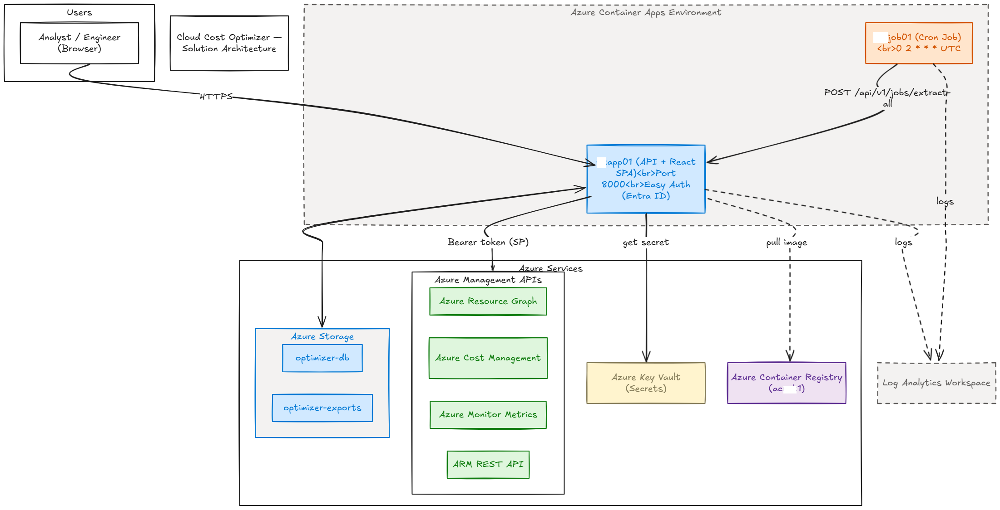
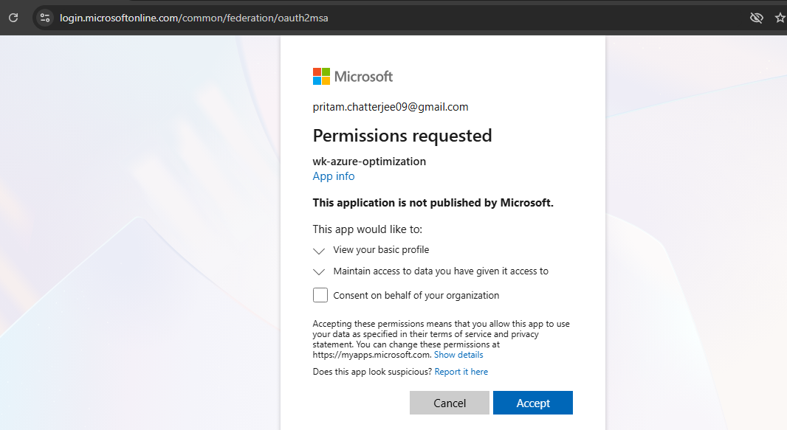
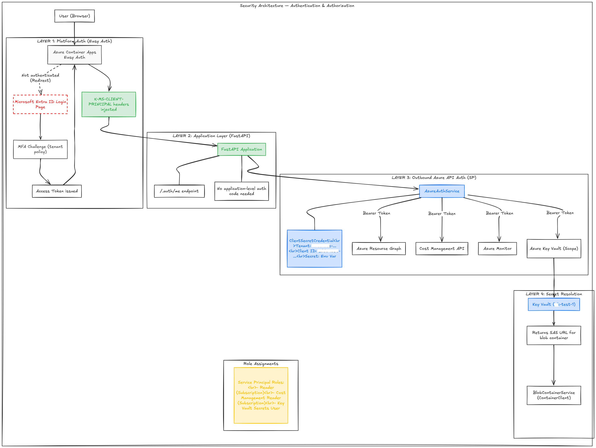
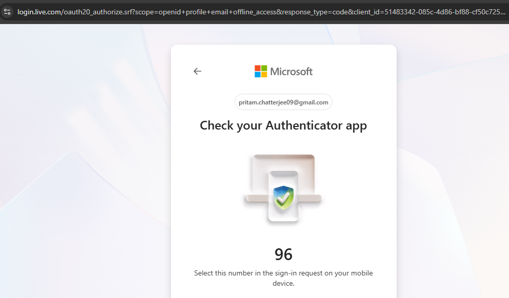
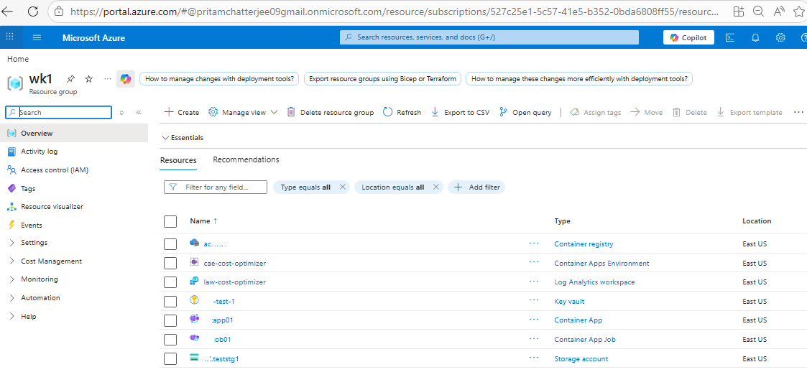

# Cloud Cost Optimizer & Remediation Engine
### Wolters Kluwer 2026 New Hire Graduate Vibe Coding Challenge
**Candidate:** Pritam Chatterjee | **Date:** May 2026 | **Project:** FinOps — Project #1

---

## Slide 1 — The Problem

> **Azure cloud waste is invisible until it's expensive.**

- Orphaned disks, idle VMs, cold storage, and unused services silently accumulate cost
- Manual audits are time-consuming, error-prone, and never run often enough
- Teams lack a single-pane view of waste + actionable remediation scripts

**Challenge:** Build a Python-based, API-first Cloud Cost Optimizer & Remediation Engine using a free-tier database and a dashboard.

---

## Slide 2 — My Solution

### Cloud Cost Optimizer & Remediation Engine

A fully automated, cloud-native platform that:

1. 🔍 **Discovers** waste across 10 Azure resource types via Azure Resource Graph + ARM
2. 💰 **Quantifies** financial impact using Azure Cost Management (30-day lookback)
3. 🛠️ **Generates** executable PowerShell remediation scripts (tagging + deletion)
4. 📊 **Visualises** findings in a secure, authenticated React dashboard
5. ⏰ **Runs nightly** via a Container App Job cron (`0 2 * * *` UTC)

**Live URL:** `https://tstapp01.victorioushill-b232d8dc.eastus.azurecontainerapps.io`

---

## Slide 3 — High-Level Architecture

```
Browser (User)
     │ HTTPS
     ▼
Azure Container App (tstapp01)
  ├── Easy Auth — Entra ID MFA
  └── FastAPI + React SPA (port 8000)
          │
          ├──► Azure Resource Graph API     (enumerate all resources)
          ├──► Azure Cost Management API    (30-day cost per resource)
          ├──► Azure Monitor Metrics API    (CPU, HTTP, connections)
          └──► ARM Resources API            (disk state, properties)

Container App Job (tstjob01)
  └── Cron: 0 2 * * * UTC  →  triggers full analysis pipeline

Azure Storage Account (tstteststg1)
  ├── optimizer-db/optimizer.db    (SQLite — blob-synced)
  └── optimizer-exports/scripts/   (PS1 scripts zipped for download)

Azure Key Vault (tst-test-1)
  └── SAS tokens — never in code or env vars
```



---

## Slide 4 — What Gets Detected (10 Resource Types)

| Resource Type | Detection Logic |
|---|---|
| Virtual Machines | Avg CPU < 5% over 30 days |
| AKS Clusters | Node CPU < 10% over 30 days |
| Managed Disks | `diskState == Unattached` |
| App Services | Zero HTTP requests in 30 days |
| Azure Functions | Zero invocations in 30 days |
| Logic Apps | Zero run history in 30 days |
| ADF Pipelines | Zero pipeline runs in 30 days |
| SQL Databases | Zero connections in 30 days |
| Cosmos DB Accounts | Zero requests in 30 days |
| Storage Accounts | No transactions in 30 days |

Each finding gets a **severity** (high / medium / low) and **estimated monthly savings**.

---

## Slide 5 — The Dashboard



**Key panels:**
- 💡 KPIs — Total waste ($), total findings, resources scanned
- 📋 Findings table — filterable by severity, resource type, subscription
- 📥 Script download — ZIP of ready-to-run PowerShell tagging + deletion scripts
- 🕐 Job history — every pipeline run with status and duration

---

## Slide 6 — Security Architecture



| Layer | Implementation |
|---|---|
| **Auth** | Azure Entra ID Easy Auth — platform-managed, zero app code |
| **MFA** | Enforced via tenant Conditional Access policy |
| **Authorization** | Service Principal: Reader + Cost Management Reader roles |
| **Secrets** | Azure Key Vault — SAS URLs fetched at runtime, never stored in code |
| **Transport** | HTTPS enforced at Container App ingress |



---

## Slide 7 — Azure Infrastructure (IaC with Terraform)

```
Resource Group: tst1  (East US)
├── Azure Container Registry: acrtst1
├── Container App Environment: cae-cost-optimizer
│   ├── Container App: tstapp01  (API + React SPA)  min=1 replica
│   └── Container App Job: tstjob01  (nightly cron)
├── Azure Key Vault: tst-test-1
└── Azure Storage Account: tstteststg1
```



**All infrastructure defined as Terraform IaC** in `infra/` — repeatable, version-controlled, zero manual portal clicks.

---

## Slide 8 — Tech Stack

| Layer | Technology |
|---|---|
| **Backend API** | Python 3.11, FastAPI, SQLAlchemy, uvicorn |
| **Database** | SQLite (blob-backed) — upgrade path: PostgreSQL / MySQL / SQL Server |
| **Frontend** | React 18, Vite, Tailwind CSS |
| **Container** | Multi-stage Docker build (Node → Python), single image |
| **Cloud** | Azure Container Apps, Azure Container Registry |
| **IaC** | Terraform (azurerm ~> 3.110) |
| **CI/CD** | Azure Pipelines (`azure-pipelines.yml`) |
| **Auth** | Azure Entra ID Easy Auth |
| **Secrets** | Azure Key Vault |
| **AI Tool** | GitHub Copilot (end-to-end — no manual code edits) |

---

## Slide 9 — Vibe Coding Workflow

> **"Lead Architect mode: ON. I am the architect; Copilot is the engineer."**

- ✅ **No manual code edits** — every line of code generated by GitHub Copilot via prompt
- ✅ **Full audit log** in [`prompts.md`](../prompts.md) — 971 lines of every instruction given
- ✅ **Same AI tool end-to-end** — GitHub Copilot in VS Code throughout
- ✅ **MVP delivered** within challenge time window

**Prompt engineering discipline highlights:**
- Architectural decisions made by human; implementation delegated to AI
- Bugs described in natural language → AI provided all fixes
- Every design trade-off documented in `DESIGN_AND_ARCHITECTURE_v1.0.md`

---

## Slide 10 — Deliverables Checklist

| # | Deliverable | Status |
|---|---|---|
| 1 | Tagle.ai "Tag" output summary | ✅ Included (`documents/Tagle assessment & other screenshots.docx`) |
| 2 | Public GitHub Repository | ✅ `https://github.com/priamc09/cloud-cost-remediation` |
| 3 | `prompts.md` audit log | ✅ 971 lines of full prompt history |
| 4 | AI-generated Presentation Deck | ✅ This document (`docs/presentation.md`) |
| 5 | Cloud resources decommissioned | ✅ Container App stopped (HTTP 404 — App stopped) |

---

## Slide 11 — Key Takeaways

1. **Agentic Orchestration works** — A non-trivial production-grade system built entirely through AI prompting
2. **Architecture thinking > syntax** — The human value is in system design, trade-off decisions, and prompt precision
3. **FinOps matters** — Cloud waste is a real problem; automated detection + remediation delivers immediate ROI
4. **Security first** — Easy Auth + Key Vault + MFA baked in from day one, not bolted on
5. **IaC is non-negotiable** — Terraform ensures reproducible, auditable infrastructure

---

*Built with GitHub Copilot | Wolters Kluwer 2026 New Hire Graduate Vibe Coding Challenge*
